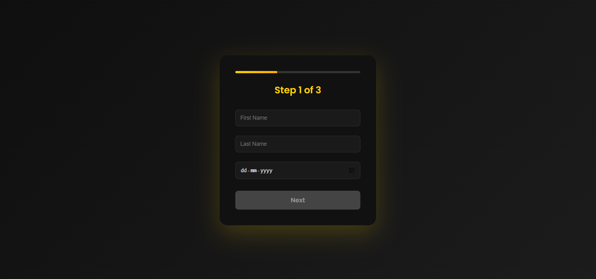

#  Multi Step Form (React)

A modern and responsive multi-step form built using React.js.  
This project includes form validation, password toggle, and clean UI design.

##  Features

- Multi-step form navigation
- Form validation
- Show/Hide password
- Date input support
- Responsive design
- Dark theme UI

##  Tech Stack

- React.js
- CSS3
- JavaScript (ES6)

##  Installation

1. Clone the repository
2. Run `npm install`
3. Run `npm start`

##  Purpose

This project was built to practice React concepts like:
- useState
- Conditional Rendering
- Component structure
- Form handling

## Live Demo Link
https://registration-wizard.vercel.app/

## YouTube Link
https://youtu.be/TPVbjK6NfNk?si=4ATUjoZL9rb-uV_P

##  Home Page

